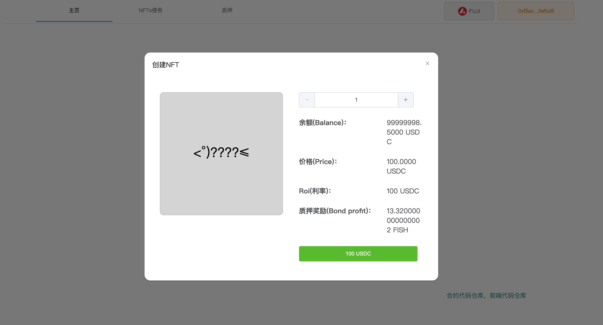

# FISH-DAPP

### Project setup

```
yarn install
```

### Compiles and hot-reloads for development

```
yarn serve
```

## 简介

这个项目的合约部署在 FUJI 链上，项目中使用的 USDC 都为新部署的 Token 并非有价值的 USDC，此版本为 demo 前端部分存在部分异常但不影响展示项目玩法。\
具体合约逻辑参考代码仓库：

```
https://github.com/lesser-P/fish-contract
```

Demo 网址

```
https://fish-dapp.4everland.app/#/home
```

## 前端效果

**首页**


**购买 NFT**



**NFTs 债券**


**质押**


